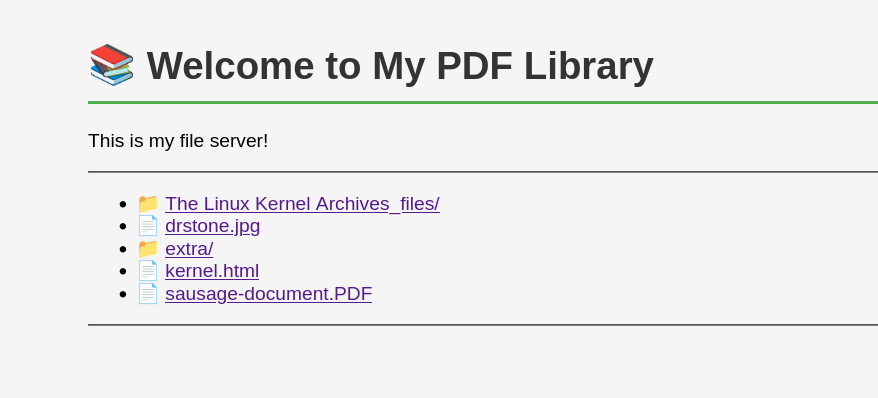

# Lab 1 Report: HTTP Server and Client Implementation


**Student:** [Rabus George FAF-233]  
**Course:** Programare in Retea  
**Date:** October 27, 2025  

## Source Directory structure:


## Docker Compose Execution

The project can be deployed using Docker Compose with the following commands:

```bash
docker compose build

docker compose up

```


docker desktop:


## Server 

And here is how localhost on port 8000 looks like:



server response from accessing /extra directory, test.txt then going back to root directory


trying to access something that doesnt exist:


## Client Application Usage

The client operates independently of the Docker Compose environment. Execution follows this pattern:

```bash
python client.py <server_host> <server_port> <url_path> [save_directory]
```
while save_directory is optional, default location is `./downloads`


Successfully retrieving test.txt from the extra/ directory

when a directory is requested instead of a file, it prints all of its contents, just like a unix 'ls' command


trying to access something that doesnt exist through the client:


## Accesing friend's server


I connected through my phone on the ip address `http://192.168.122.8:8000/` and could easily have the same functionality as I have on my pc.
