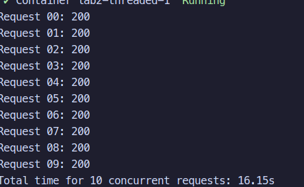
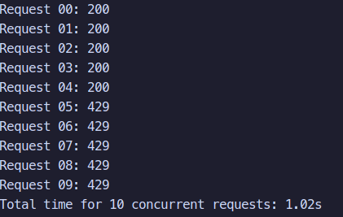
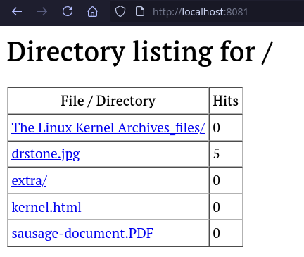
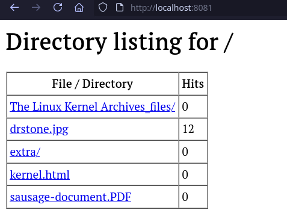
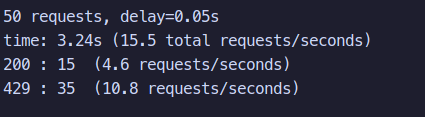
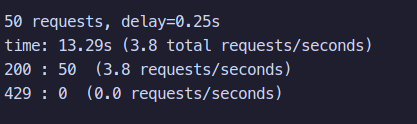
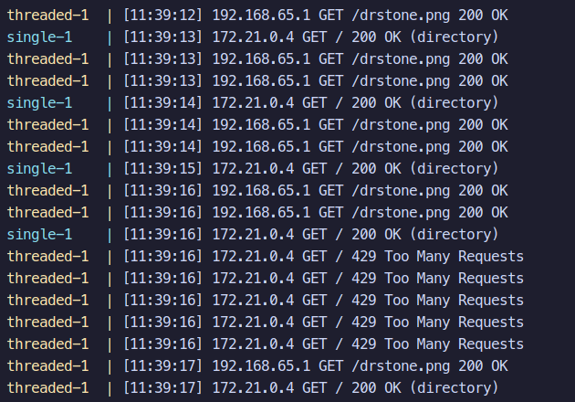

# Laboratory 2 Report

## Starting the Container

From within the Lab2 directory, build the test container and launch the single-threaded server using:

```bash
docker compose build tester
docker compose up single threaded
```

---

## Performance comparison

In a separate terminal window, run the tester:

```bash
docker compose run --rm tester
```

Single-threaded results:



Multi-threaded results:



---

## Hit counter and race condition

A race condition became noticeable when running **test.py** with 50 simultaneous requests directed at the same resource on the multi-threaded server, after temporarily removing the synchronization mechanism around the hit counter.

Problematic implementation:

```python
current = hit_count[str(fs_path)]
time.sleep(0.05)   
hit_count[str(fs_path)] = current + 1
```



Corrected implementation using a lock:

```python
with hit_lock:
      hit_count[str(fs_path)] += 1
```



---

## Rate limiting

```bash
python testing/rate_test.py       
```

With the rate limiter configured to allow 10 requests per second per client:

With requests below limit:



With requests above the limtit:



---

## Different IP test

Commands used:

```bash
docker compose run --rm tester python3 testing/rate_limit_ip_test.py
```

```bash
python3 testing/rate_limit_ip_test.py
```

Run both while `docker compose up threaded` is active.

To verify per-IP throttling, two separate clients were launched simultaneously using **rate_test_ip.py**.
Client A (inside a Docker container) repeatedly accessed the content directory and exceeded the rate limit, resulting in many `429 Too Many Requests` responses.
Client B (executed directly on the host) requested a PNG file and continued to receive `200 OK` since it had its own independent rate limit.



